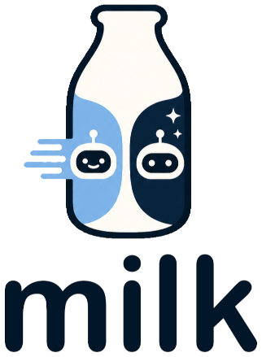

# milk



Switch models, not context.

milk is a terminal AI assistant that routes each prompt between a fast primary agent and a deep escalation agent — keeping the full conversation in sync across both. Start cheap. Go deep when you need it. Switch mid-workflow.

## Install

Pre-built binary (macOS, Linux, Windows via WSL2):

```sh
curl -fsSL https://raw.githubusercontent.com/scoutme/milk/main/install.sh | sh
```

Installs to `~/.local/bin/milk`, verifying the release checksum. Pin a specific version with `MILK_VERSION=v0.2.0`.

Build from source instead (`git clone` + `task build`, or in one line):

```sh
curl -fsSL https://raw.githubusercontent.com/scoutme/milk/main/install-from-source.sh | sh
```

Requires Go 1.21+. See [docs/getting-started.md](docs/getting-started.md) for what to do next.

## What it does

- **Automatic routing** — each prompt is classified and sent to the right agent without you changing tools
- **Context handoff** — when escalation fires, the primary conversation is reformatted as context; the escalation agent orients itself without a separate setup step
- **Persistent memory** — a Percept store survives across sessions; key facts are reinforced, decay, and promote to long-term memory over time (NREM consolidation)
- **Built-in tools** — the primary agent has bash, file read/write/edit, grep, find, HTTP GET, session access, and memory tools without any extra configuration
- **Streaming TUI** — bubbletea terminal UI with a scrollable transcript, live memory panel, status bar, and input history
- **Loop detection** — monitors agent output for repeating patterns; warns in the status bar and auto-interrupts when the agent gets stuck looping (configurable, works with all providers)
- **Aider and smolagents** — plug in aider-chat or smolagents as either the primary or escalation agent
- **Evaluation harness** — run the same scenarios against different agents (or against the Claude Code CLI directly) and compare LLM-judged quality, tokens, cache efficiency, and latency side-by-side (`milk eval`)

## Backends

Both the primary and escalation roles support any of these backends — there is no backend tied exclusively to one role:

| Provider value | Backend |
| --- | --- |
| `"claude-cli"` | **Claude Code CLI** — runs `claude` as a subprocess; full tool access, session continuity, permission management |
| omit / `""` / `"local"` | Any OpenAI-compatible server (llama.cpp, Ollama, LM Studio, Azure OpenAI, …) |
| `"bedrock"` | AWS Bedrock — native Converse API, SigV4 signing, credential auto-refresh |
| `"aider-cli"` | aider — milk calls the `aider` binary directly, no adapter needed |
| `"subprocess"` | Generic NDJSON subprocess (milk-smolagent adapter, bundled automatically) |
| anything else | Bearer-token HTTP (OpenRouter, Groq, Together.ai, GitHub Models, …) |

> If no agent is configured, milk starts in setup mode. Use `/agent add` to configure a backend interactively.

## How routing works

Each prompt passes through a decision chain:

1. **Explicit flags** — `--escalate` or `--primary` override everything
2. **Session state** — if the escalation agent asked a follow-up, the next turn goes directly back to it
3. **Rules layer** — hard thresholds (token length, keywords) then a weighted signal scorer
4. **Primary model classifier** — the primary model decides `local` or `escalate` when the scorer is inconclusive
5. **Default** — local

When the primary model cannot handle a task, it calls `escalate(reason)` and milk reformats the conversation history as context for the escalation agent.

Once escalation fires, **auto-sticky** keeps subsequent turns on the escalation agent (shown as `<agent> (sticky)` in the status bar) — avoiding the "cold-start" penalty on each turn. Use `/primary` to return to the primary agent.

## Observability

milk exports OpenTelemetry signals to JSONL files under `~/.milk/otel/`. The CLI exposes `/metrics`, `/otel`, `/otel trim`, and `search_signals` for inspection and maintenance.

- `/metrics` shows the latest value for each metric+label combination.
- `/otel` shows file sizes, record counts, and timestamp bounds.
- `/otel trim` archives the current files and recreates empty ones.
- `search_signals` searches the raw JSONL files case-insensitively.

These commands are additive and do not require an external observability backend.

## Evaluation

`milk eval` runs the same task scenarios against whichever agents you've configured — compare your primary agent against your escalation agent, two different local models, or `milk-tui` against the raw `claude` CLI — and reports LLM-judged quality, token/cache usage, and latency side-by-side.

```sh
milk eval --list                                        # available adapters
milk eval run --agents claude-code,milk-tui              # compare on every scenario
milk eval run --agents "milk-tui[--agent,mimo-local]"    # pin a specific configured agent for this run
milk eval report --results eval/results                 # re-print the last report
```

See [docs/eval.md](docs/eval.md) for scenario format, per-adapter options, and judge configuration.

## Prerequisites

- Go 1.21+ — only if building from source; the pre-built binary needs nothing but the [install script](#install)
- At least one configured agent backend (primary and/or escalation — each is optional; milk degrades gracefully if either is absent)
- `aider-chat` pip package — only if using the `aider-cli` provider
- `smolagents[litellm]` pip package — only if using the `subprocess`/smolagent provider

See [docs/getting-started.md](docs/getting-started.md) for the fastest path to a working setup, [docs/providers.md](docs/providers.md) for provider-specific configuration (including a reference local setup with NVIDIA GPU, Ubuntu/WSL2, llama.cpp from source), and [docs/eval.md](docs/eval.md) for evaluating and comparing agents.
