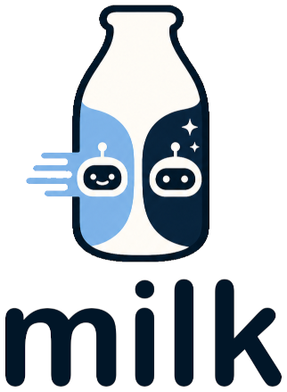

# milk



Switch models, not context.

milk is a terminal agent host that routes each prompt between a cheap primary agent and a deep escalation agent — keeping the full conversation in sync across both — then goes further: tools, MCP, multi-agent workflows, persistent memory, and an eval harness. Start cheap. Go deep when you need it. Switch mid-workflow.

## Install

Pre-built binary (macOS, Linux, Windows via WSL2):

```sh
curl -fsSL https://raw.githubusercontent.com/scoutme/milk/main/install.sh | sh
```

Installs to `~/.local/bin/milk`, verifying the release checksum. Pin a specific version with `MILK_VERSION=v0.2.0`.

Build from source instead (`git clone` + `task build`, or in one line):

```sh
curl -fsSL https://raw.githubusercontent.com/scoutme/milk/main/install-from-source.sh | sh
```

Requires Go 1.21+. See [docs/getting-started.md](docs/getting-started.md) for what to do next.

## What it does

**Route** — automatic per-prompt routing between agents, sticky escalation, and context handoff that reformats the primary conversation so the escalation agent orients itself without a separate setup step. Explicit `--escalate`/`--primary`, self-escalation via `escalate(reason)`, and a streaming bubbletea TUI (transcript, side panels, input history) on top.

**Any backend, either role** — OpenAI-compatible servers, AWS Bedrock (native Converse), Claude Code CLI, aider, smolagents, or any Bearer-token HTTP provider can be primary or escalation. The only constraint milk asks you to honor: the escalation agent should be smarter (and usually pricier) than the primary.

**Act** — built-in tools (bash, file I/O, grep/find, HTTP, session context, memory, tasks) with no extra configuration, plus MCP servers (stdio or HTTP, OAuth-aware) and agent-as-tool — expose any configured agent as a callable tool to any other.

**Orchestrate** — `spawn_background_agent` forks the calling agent for async research with its own tool loop; the native `/workflow` engine runs multi-agent pipelines (`dev`, `pair`, `swarm`, or your own YAML) with typed verdicts, checkpoint/resume, and a live-attach view for background jobs and workflow stages.

**Remember & stay safe** — a Percept store with NREM consolidation survives across sessions; loop detection watches for repeating patterns and can auto-interrupt; persistent task tracking keeps goals in front of the agent.

**Measure** — token usage by role (`/usage`), OpenTelemetry file exporters (`/metrics`, `/otel`), and `milk eval` — run the same scenarios against different agents and compare LLM-judged quality, tokens, cache efficiency, and latency side-by-side.

**Embed** — `milk serve --acp` runs milk as a long-lived [Agent Client Protocol](https://agentclientprotocol.com) v2 agent an editor can spawn and drive over JSON-RPC; `--output-format json|stream-json` gives one-shot prompts a machine-readable alternative to the TUI for scripts and CI. See [docs/acp-integration.md](docs/acp-integration.md) for exactly what's implemented today.

## Backends

Both the primary and escalation roles support any of these backends — there is no backend tied exclusively to one role:

| Provider value | Backend |
| --- | --- |
| `"claude-cli"` | **Claude Code CLI** — runs `claude` as a subprocess; full tool access, session continuity, permission management |
| omit / `""` / `"local"` | Any OpenAI-compatible server (llama.cpp, Ollama, LM Studio, Azure OpenAI, …) |
| `"bedrock"` | AWS Bedrock — native Converse API, SigV4 signing, credential auto-refresh |
| `"aider-cli"` | aider — milk calls the `aider` binary directly, no adapter needed |
| `"subprocess"` | Generic NDJSON subprocess (milk-smolagent adapter, bundled automatically) |
| anything else | Bearer-token HTTP (OpenRouter, Groq, Together.ai, GitHub Models, …) |

> If no agent is configured, milk starts in setup mode. Use `/agent add` to configure a backend interactively.

## How routing works

Each prompt passes through a decision chain:

1. **Explicit flags** — `--escalate` or `--primary` override everything
2. **Session state** — if the escalation agent asked a follow-up, the next turn goes directly back to it
3. **Rules layer** — hard thresholds (token length, keywords) then a weighted signal scorer
4. **Primary model classifier** — the primary model decides `local` or `escalate` when the scorer is inconclusive
5. **Default** — local

When the primary model cannot handle a task, it calls `escalate(reason)` and milk reformats the conversation history as context for the escalation agent.

Once escalation fires, **auto-sticky** keeps subsequent turns on the escalation agent (shown as `<agent> (sticky)` in the status bar) — avoiding the "cold-start" penalty on each turn. Use `/primary` to return to the primary agent.

## Observability

milk exports OpenTelemetry signals to JSONL files under `~/.milk/otel/`. The CLI exposes `/metrics`, `/otel`, `/otel trim`, and `search_signals` for inspection and maintenance.

- `/metrics` shows the latest value for each metric+label combination.
- `/otel` shows file sizes, record counts, and timestamp bounds.
- `/otel trim` archives the current files and recreates empty ones.
- `search_signals` searches the raw JSONL files case-insensitively.

These commands are additive and do not require an external observability backend.

## Evaluation

`milk eval` runs the same task scenarios against whichever agents you've configured — compare your primary agent against your escalation agent, two different local models, or `milk-tui` against the raw `claude` CLI — and reports LLM-judged quality, token/cache usage, and latency side-by-side.

```sh
milk eval --list                                        # available adapters
milk eval run --agents claude-code,milk-tui              # compare on every scenario
milk eval run --agents "milk-tui[--agent,mimo-local]"    # pin a specific configured agent for this run
milk eval report --results eval/results                 # re-print the last report
```

See [docs/eval.md](docs/eval.md) for scenario format, per-adapter options, and judge configuration.

## Prerequisites

- Go 1.21+ — only if building from source; the pre-built binary needs nothing but the [install script](#install)
- At least one configured agent backend (primary and/or escalation — each is optional; milk degrades gracefully if either is absent)
- `aider-chat` pip package — only if using the `aider-cli` provider
- `smolagents[litellm]` pip package — only if using the `subprocess`/smolagent provider

See [docs/getting-started.md](docs/getting-started.md) for the fastest path to a working setup, [docs/providers.md](docs/providers.md) for provider-specific configuration (including a reference local setup with NVIDIA GPU, Ubuntu/WSL2, llama.cpp from source), and [docs/eval.md](docs/eval.md) for evaluating and comparing agents.

## Acknowledgments

milk's prompt/context-management and loop-detection design was informed by studying (not copying
code from) other coding-agent harnesses — independent implementations compared directly against
milk's own, not ports:

- **[Claude Code](https://claude.com/claude-code)** — the escalation-agent subprocess milk drives via `claude --print`, and the reference for milk's own project-instruction loading (AGENTS.md/CLAUDE.md).
- **[MiMo-Code](https://github.com/XiaomiMiMo/MiMo-Code)** (Xiaomi's fork of OpenCode) — compared for loop-detection thresholds (the doom-loop gate, n-gram repetition monitor), prompt-caching breakpoint strategy, and checkpoint/distillation memory design.
- **[OpenCode](https://github.com/anomalyco/opencode)** — compared for `AGENTS.md` project-instruction loading, sub-agent context isolation (`ForkContext`), and prompt-caching strategy.

See [docs/prompt-context-management-review.md](docs/prompt-context-management-review.md) for the full comparison and what came out of it.
